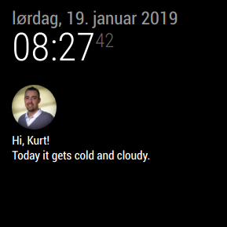

# MMM-Profile
A simple module to show a profilpicture with your name and wheater report for your MagicMirror.
Set the URL to the profilpicture, and your name in your config. Look at configuration options bellow

To get the wheater report to work, you must use it with the default currentweather module.

Note: I'm new to the Node.js, this is my first real module. There are probably lot's of things that could have been done better. :)

Based on Default compliments, for the weather report.

### Screenshot





## Usage

_Prerequisites_

- Requires MagicMirror v2.1.0

### Installation

In your terminal, go to your MagicMirror's Module folder:

```
cd ~/MagicMirror/modules
```

Clone this repository:

```
git clone https://github.com/kurtern84/MMM-profile.git
```

Add some [config entries](#configuration) with the atleast the requierd [options](#options) in your config.js file. 

### Configuration

```javascript
{
    module: "MMM-Profile",
    position: "top_left",
    config: {
        // Transparency of the picture.
        opacity: 1.0,
        // Maximum width of the picture.
        maxWidth: "5%",
        // Maximum height of the picture.
        maxHeight: "5%",
        // Border-Radius of the picture.
        borderRadius: "50%",
        // The URL to the picture.
        url: "https://www.yourpicture.com",
        // Add a profile name.
        yourName: "Hi, Jonh Doe!",
        // Add some random text to show.
        randomText: "",
        // Compliments
        compliments: {
                        day_sunny: [
                                "Today it is sunny, get out!"
                        ],
                        snow: [
                                "Today it gets snowy, dress well."
                        ],
                        cloudy: [
                                "Today it gets cloudy, okay to stay inside."
                        ],
                        day_cloudy: [
                                "Today it gets cloudy, okay to stay inside."
                        ],
                        cloudy_windy: [
                                "Today, there is a lot of wind, dress well, can get cold."
                        ],
                        showers: [
                                "Today its rain, remember umbrella."
                        ],
                        rain: [
                                "Today its rain, remember umbrella."
                        ],
                        thunderstorm: [
                                "Today its thunderstorm"
                        ],
                        night_cloudy: [
                                "Tonight it gets cold and cloudy."
                        ],
                        night_clear: [
                                "It is clear sky tonight"
                        ],
                        night_showers: [
                                "If you are going out tonight, bring an umbrella"
                        ],
                        night_rain: [
                                "If you are going out tonight, bring an umbrella"
                        ],
                        night_thunderstorm: [
                                "Tonight there will be a thunderstorm, take out power cords."
                        ],
                        night_snow: [
                                "Cold and snow."
                        ],
                        night_alt_cloudy_windy: [
                                "Varying weather."
                        ],
                        fog: [
                                "Poor visibility! Drive carefully."
                        ]
                    }
            }
    },
```

### Options
Here are the configuration options to configure the module.

| Option | Description |
|---|---| 
|`opacity`|Transparency of the picture. 1.0 is not transperent at all<br><br>**Default value:** `1`|
|`maxWidth`|Maximum width of the picture..<br><br>**Default value:** `5%`|
|`maxHeight`|Maximum height of the picture.<br><br>**Default value:** `5%`|
|`borderRadius`|Make the picture circular.<br><br>**Default value:** `5%`|
|`url`|The URL to the picture.<br><br>**Requierd value:** `URL`|

All done. :)
